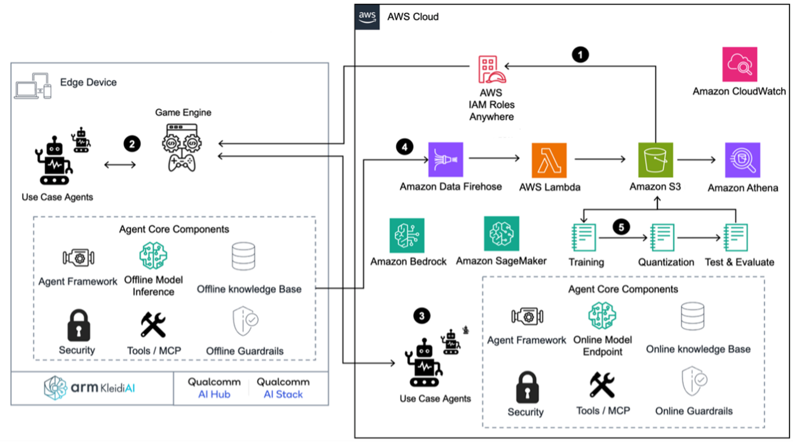

# Revolutionizing games with small language model AI companions

by Patrick Palmer, Aaron Brown, and Andrei Muratov on 12 JUN 2025

[Original AWS Blog For Games: Revolutionizing games with small language model AI companions](https://aws.amazon.com/blogs/gametech/revolutionizing-games-with-small-language-model-ai-companions/)

In-game generative AI is enabling new player experiences. However, implementing AI-driven features in games can be challenging due to latency and device computing power. We’ll explore one innovative solution: leveraging players’ mobile devices to run small language models (SLM) as companion applications.

Instead of integrating SLM features directly into resource-constrained game environments, consider developing a companion application that runs on the player’s smartphone and connects to their game. This approach enables powerful AI-driven features without compromising core game performance.

Mobile companions provide AI coaching that helps newcomers navigate complex mechanics in established games with steep learning curves, creating a more welcoming environment by bridging the experience gap. [Steam](https://store.steampowered.com/) achievement data reveals that in games, with both single and multiplayer modes, a minority of players attempt multiplayer content (Mortal Kombat X – 28.7 percent, Project CARS 2 – 20 percent, Civilization VI – 38.7 percent), with fewer becoming regular participants.

Learning curves create entry barriers that discourage engagement. AI companions reduce these barriers through personalized coaching, gradually building player confidence and facilitating the transition from solo play to multiplayer communities. [2025 research](https://dl.acm.org/doi/10.1145/3706598.3713576) found that effective AI assistance in games “must go beyond simply instructing players on how to play the game. Instead, it should offer transparent guidance that increases their understanding of the game and encourages active engagement with the game’s mechanics”.

Modern smartphones efficiently run 1-3 billion parameter models using hardware acceleration frameworks like XNNPack for Android or Apple Metal Performance Shaders (MPS) for iOS. This capacity is expected to grow as mobile processors advance and frameworks improve. By leveraging the on-device AI processing, developers can shift computational demands away from their game servers or console hardware, preserving resources for core gameplay functionality.

Developers can update the companion app independently from the main game, allowing for faster feature development and experimentation with AI capabilities. This separation creates a nimble development cycle for AI features without requiring full game patches. Because players provide the hardware for model inference, ongoing operational costs remain low while maintaining AI feature quality.

Even when games run on consoles with limited connectivity, smartphones provide a reliable communication channel to the game’s services. This persistent connection enables continuous engagement even when the primary gaming platform is offline.

### Use cases: AI player coach and guide

An AI companion transforms player experiences through contextual guidance. When players need navigation assistance, they can naturally ask questions like, “Where can I sell my inventory?” The system can immediately provide answers based on their current game state. Players seeking strategic advice can receive personalized recommendations that match their progress when they ask, “What should I do next?” Those looking to improve can receive tailored coaching by asking, “How can I enhance my skills?”

Particularly valuable in simulator games, where most of the learning curve involves understanding how to operate the simulated systems, players can ask practical questions. For example, “How do I turn on the airplane?” or “What’s the correct approach speed for this aircraft?” The player can then receive immediate, contextual instructions—essentially providing an interactive manual that responds precisely when needed.

An advanced implementation could further evolve this concept through proactive assistance that anticipates player needs. By analyzing gameplay patterns and detecting moments of confusion or inefficiency, the AI could offer timely suggestions without requiring players to formulate questions. This could become critical when their attention is focused on gameplay. For example, the system could notice a player repeatedly failing to activate a crucial system in a flight simulator. The AI companion then might briefly highlight the correct control with a non-intrusive prompt, reducing frustration while maintaining immersion.

The SLM’s direct connection to the game provides comprehensive contextual information. This allows it to incorporate current game states when responding to player inquiries, resulting in highly relevant interactions. Mobile platforms offer supplementary screen space as a small extension of the main games display screen that can be utilized for visual assistance, ensuring consistent AI experiences regardless of connectivity status or game engine.

### Expanded player engagement

A mobile companion could extend a game’s relationship with players beyond traditional gaming sessions. This persistent engagement outside of standard gameplay hours could establish new communication channels that complement emails and in-game notifications. The continuous availability of personalized assistance based on individual player journeys could create stronger connections between players and the game world.

These companions could serve dedicated players as game management systems—scheduling events into calendars, sending preparedness reminders, and coordinating player availability. AI agents can handle repetitive tasks during offline periods. Translation features could break down language barriers in global communities, providing cultural context that fosters international collaboration that are currently impossible through traditional means.

### Technical implementation

Agentic workflows unify software systems designed for developing and deploying autonomous AI agents that independently perform tasks, make decisions, and adapt to changing environments with minimal human intervention. It supports multiple generative AI use cases while maintaining seamless parity between on-device and cloud environments through a modular open systems framework and RESTful APIs. This architecture facilitates consistent AI experiences across different deployment contexts while maintaining security, performance, and user privacy.

#### Core workflow components

 * **Inference engine**: Implements efficient on-device processing using optimized open-source SLMs with 4-bit quantization by using [Arm KleidiAI](https://gitlab.arm.com/kleidi/kleidiai) for consumer hardware. Seamlessly transitions to cloud-based models when online and leverages continuous batching for optimal performance across completion, chat, and embeds generation patterns.

 * **Agentic memory**: Maintains persistent short-term and long-term memory stores across sessions with cloud synchronization. Implements efficient vector storage with priority-based retention for rapid contextual information retrieval while enforcing privacy-preserving mechanisms at both the edge and cloud levels.

 * **Guardrails system**: Enforces safety boundaries through multi-layered filtering and constraints that operate independently on-device. Implements deterministic guardrails with semantic validation that receive cloud policy updates while maintaining organizational compliance.

 * **Observability framework**: Captures critical performance metrics, user interactions, and model behaviors through [Amazon CloudWatch](https://aws.amazon.com/cloudwatch/) for continuous system monitoring. Enables product improvement through anonymized telemetry data processed through [Amazon Data Firehose](https://aws.amazon.com/firehose/), Amazon Web Services [(AWS) Lambda](https://aws.amazon.com/lambda/), and Amazon Simple Storage Service ([Amazon S3](https://aws.amazon.com/s3/)), with analytics through [Amazon Athena](https://aws.amazon.com/athena/).

 * **Agent framework**: Orchestrates interactions between specialized agents and underlying system components. Provides standardized interfaces for agent communication while managing the workflow, security boundaries, and tool access permissions across deployment environments.

 * **Tools integration**: Delivers extensible tool frameworks for task execution including Model Context Protocol (MCP) for direct game engine commands. Supports cross-platform implementation with specialized tools for content generation, dialogue management, and scene manipulation with unified API access.

 * **Security framework**: Implements [AWS Identity and Access Management (IAM) Roles Anywhere](https://aws.amazon.com/iam/roles-anywhere/) for secure certificate exchange and artifact deployment with comprehensive encryption. Enforces strict security boundaries between agents, with runtime vulnerability detection and mitigation across both on-device and cloud environments.

 * **Edge inference integration**: Leverages strategic partnerships with [Arm Inc.](https://partners.amazonaws.com/partners/0010L00001kYqn8QAC/Arm%20Inc) and [Qualcomm](https://partners.amazonaws.com/partners/001E000001IpQSGIA3/Qualcomm) to optimize model performance on consumer hardware with up to [20 percent faster](https://community.arm.com/arm-community-blogs/b/ai-blog/posts/llm-inference-llama-quantized-models-executorch-kleidiai) inference. Enables seamless quantization and deployment through [Amazon SageMaker](https://aws.amazon.com/sagemaker/) while supporting diverse devices and CPU architectures.

The AI model represents only a small fraction of a complete AI solution; the vast majority comprises the essential components needed for secure, scalable, and effective production deployment. It focuses on delivering a complete solution that integrates critical components while verifying high performance, security, and scalability across the edge and cloud environments.

_Figure 1: Generative AI agents modular design._

The architecture demonstrates a modular open systems design for implementing generative AI agents, enabling rich in-game experiences through edge and cloud services. It facilitates secure, scalable operations and developer experience with seamless integration by using APIs configurable through existing SDKs.

1. **Artifact deployment**: IAM Roles Anywhere securely exchanges certificates to pull application, agent, and model artifacts from Amazon S3. These are deployed using the existing over-the-air update solution.

2. **Offline generative AI agents at the edge**: Edge agents are preconfigured and initialized once core components are installed. They perform specific use-case functions and communicate with the game engine through a unified API.

3. **Online agents and inference**: Online agents operate similarly to edge agents, but leverage [Amazon Bedrock](https://aws.amazon.com/bedrock/) for first and third-party models. They utilize Amazon Bedrock tooling services for advanced capabilities.

4. **Device telemetry pipeline**: Device data is ingested using Amazon Kinesis Data Firehose, processed by AWS Lambda, stored in Amazon S3, and queried through Amazon Athena. This pipeline integrates seamlessly with preexisting dashboards for analytics.

5. **Model training, quantization and evaluation**: Amazon SageMaker AI Studio provides the ability to easily leverage open-source models, leverage 3rd party or import your own model providing the ability to fine tune domain-specific models using techniques like supervised learning and knowledge distillation.

The solution implements proactive cost governance through [AWS Cost Explorer](https://aws.amazon.com/aws-cost-management/aws-cost-explorer/) and [AWS Budgets](https://aws.amazon.com/aws-cost-management/aws-budgets/), providing comprehensive financial oversight of cloud resource utilization. Resource optimization is achieved using [AWS Compute Optimizer](https://aws.amazon.com/compute-optimizer/), which recommends optimal instance configurations based on workload patterns. Additionally, the system employs comprehensive latency profiling and scalability validation tools to verify consistent performance metrics are maintained across all deployment scenarios—from edge devices to cloud infrastructure.

The development expenses and timeline for creating a single SLM are contingent upon several factors, including the necessary complexity level, target quality standards, and iteration cycles required during testing and review phases. For example, distilling knowledge to a 1 B parameter student model can be achieved within 12 hours using an ml.g6e.4xlarge [Amazon Elastic Compute Cloud (EC2)](https://aws.amazon.com/ec2/) instance. Review [Amazon SageMaker AI instance pricing](https://aws.amazon.com/sagemaker-ai/pricing/) to understand cost implications.

### Conclusion

Our mobile SLM solution offers game developers a transformative opportunity to enhance player experiences by offloading AI processing to smartphones, through companion applications, without overburdening core systems. Developers can implement sophisticated generative AI features that provide contextual guidance and personalized coaching with seamless engagement. This can all be achieved without compromising performance, while addressing technical challenges related to latency and computing power.

This innovative approach creates a more accessible environment for newcomers while simultaneously delivering deeper engagement for veterans—revolutionizing how players interact with games.

As mobile hardware advances, these companion systems will become increasingly sophisticated. They could offer more personalized assistance and expanded player engagement beyond traditional gaming sessions. Developers can continue to create more inclusive, engaging, and persistent experiences that meet players wherever they are—both within the game world and beyond.

Contact an AWS Representative to learn how we can help accelerate your business.

Further reading
 * Browse proven AWS [Solutions for Games](https://aws.amazon.com/solutions/games/) and architectures built specifically for the games industry.
 * [Discover blogs](https://aws.amazon.com/blogs/gametech/category/artificial-intelligence/) on how you can leverage the AWS comprehensive suite of generative AI services to create groundbreaking games.
 * [Guidance for Dynamic Non-Player Character (NPC) Dialogue on AWS](https://aws.amazon.com/solutions/guidance/dynamic-non-player-character-dialogue-on-aws/): Build realistic character conversations that boost player immersion and engagement.

### Authors

**Patrick Palmer**

  

Patrick Palmer is a Principal Solutions Architect for Games, Immersive, and AI/ML at AWS. He has led in the real-time 3D technology space for 25+ years, developing cutting-edge technologies and helping entertainment industry customers to navigate their greatest challenges.

**Aaron Brown**

  

Aaron Brown is a Senior generative AI Solutions Architect on the AWS Industries Customer Acceleration Team with over 8+ years of experience developing AI-enabled solutions that accelerate insights and boost productivity.

**Andrei Muratov**

  

Andrei Muratov is a Games Industry Specialist BD, specializing in Game Analytics and AI in games. He leverages his 20 years of game development and publishing experience to deliver industry-focused solutions to AWS customers.
